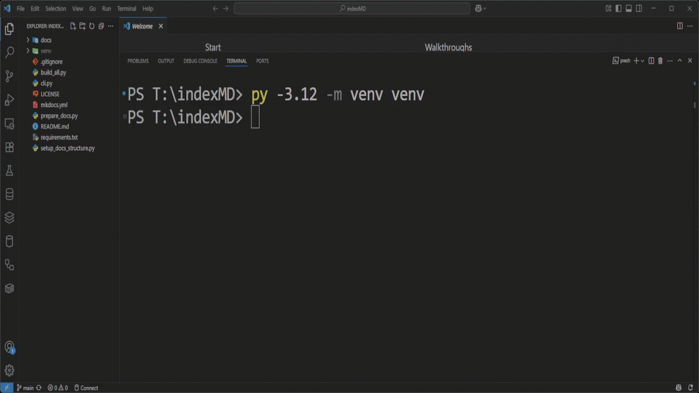
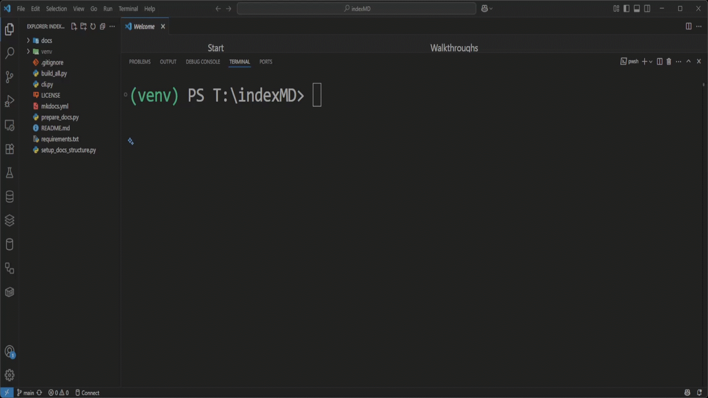
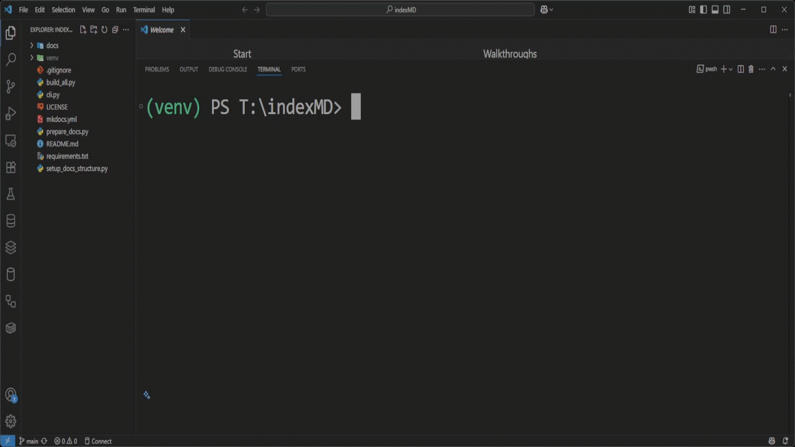

# 📦 indexMD – Markdown-Based Documentation Generator
A lightweight documentation generator powered by MkDocs and custom scripts to automate README-based documentation deployment.

---

[](LICENSE)
[](https://github.com/TamerOnLine/indexMD/wiki/01.-Home)
[](./docs/)


[](https://github.com/TamerOnLine/indexMD/stargazers)
[](https://github.com/TamerOnLine/indexMD/fork)
[](https://github.com/TamerOnLine/indexMD/issues)
[](https://github.com/TamerOnLine/indexMD/pulls)


[](https://www.python.org/downloads/release/python-3120/)
[](https://www.mkdocs.org/)
[](https://pypi.org/project/pip/)


[](https://github.com/TamerOnLine/indexMD/actions)
[](https://github.com/TamerOnLine/indexMD)
[](https://github.com/TamerOnLine/indexMD/commits)
[](https://github.com/TamerOnLine/indexMD/graphs/contributors)


[](https://github.com/TamerOnLine)

---

📘 [Live Documentation](https://tameronline.github.io/indexMD/)

---

## 📖 Full Documentation – Wiki

Need step-by-step guides on installation, usage, customization, or contributions?  
Explore the **official project Wiki** for complete technical documentation:

➡️ [View the Wiki](https://github.com/TamerOnLine/indexMD/wiki/01.-Home)

> 👤 📝 Maintained and regularly updated for all user levels: beginners, contributors, and advanced users.

---

<p align="center">
  
</p>

---

## Table of Contents

- [Features ✨](#features)
- [Clone the Repository 📥](#clone-the-repository)
- [Quick Start 🚀](#quick-start)
- [Optional: Upgrade pip (recommended) ⬆️](#optional-upgrade-pip-recommended)
- [Install Dependencies 📦](#install-dependencies)
- [indexMD Control Panel 🎛️](#indexmd-control-panel)
- [CLI Options Explained 🧩](#cli-options-explained)
- [Project Structure 🧱](#project-structure)

---

## Features

- 📄 **Markdown-based documentation**  
- 📦 **MkDocs for static site generation**  
- 📑 **Custom HTML overrides**  
- 🌐 **Customizable themes and styles**  
- 📖 **Multi-section support** (About, Contact, Privacy, Terms…)  
- 🔗 **Important links section**

<br>

[🔝 Back to Top](#table-of-contents)

---

## Clone the Repository

To get started, clone this repository to your local machine using Git:

```bash
git clone https://github.com/TamerOnline/indexMD.git
cd indexMD
```

- Make sure you have Git installed: [https://git-scm.com](https://git-scm.com)

<p align="center">
  <a href="screenshots/clone-the-repository.gif">
    
  </a>
</p>

📽️ Quick Clone of the indexMD repository in action

<br>

[🔝 Back to Top](#table-of-contents)

---

## Quick Start

### Create Virtual Environment

```bash
# Windows
py -3.12 -m venv venv
.\venv\Scripts\Activate
```

<p align="center">
  <a href="screenshots/Windows.gif">
  
  </a>
</p>
📽️ Quick setup of indexMD on Windows in action

<br>

[🔝 Back to Top](#table-of-contents)

---

```bash
# macOS / Linux
python3 -m venv venv
source venv/bin/activate
```

---

### Optional: Upgrade pip (recommended)

Before installing dependencies, it's recommended to upgrade `pip` to the latest version to avoid compatibility issues.

```bash
python -m pip install --upgrade pip
```

<p align="center">
  <a href="screenshots/Upgrade_pip.gif">
  
  </a>
</p>
📽️ Upgrading pip on Windows (recommended)

<br>

[🔝 Back to Top](#table-of-contents)

---

### Install Dependencies

```bash
pip install -r requirements.txt
```

<p align="center">
  <a href="screenshots/install.gif">
  
  </a>
</p>
📽️ Quick install of the index MD Tools in action

<br>

[🔝 Back to Top](#table-of-contents)

---

## indexMD Control Panel

```bash
py cli.py
```

<p align="center">
  <a href="screenshots/cli-panel.gif">
    
  </a>
</p>

🧠 A simple yet powerful command-line interface to manage your documentation workflow easily:  
Build, Prepare, Serve, Deploy, or just Check version — all in one menu!

### CLI Options Explained

| Option | Description |
|--------|-------------|
| `1. Build Documentation` | Generates the static site using `mkdocs build`. |
| `2. Prepare README` | Converts the `README.md` into `index.md` for homepage. |
| `3. Serve Locally` | Launches a local dev server using `mkdocs serve`. |
| `4. Deploy` | Deploys the site to GitHub Pages using `mkdocs gh-deploy`. |
| `5. Check Version` | Displays current versions of key tools like MkDocs. |
| `6. Exit` | Exits the CLI interface. |

<br>

[🔝 Back to Top](#table-of-contents)

---

## Project Structure

The following is the structure of the main project directory:

```text
./
├── 📁 docs/
│   ├── 📁 sections/
│   │   ├── about.md
│   │   ├── contact.md
│   │   ├── important-links.md
│   │   ├── privacy.md
│   │   └── terms.md
│   ├── 📁 stylesheets/
│   │   └── extra.css
│   └── index.md
├── 📁 overrides/
│   └── 📁 partials/
│       ├── footer.html
│       └── header.html
├── .gitignore
├── LICENSE
├── README.md
├── build_all.py
├── cli.py
├── mkdocs.yml
├── prepare_docs.py
└── requirements.txt

```
<br>

[🔝 Back to Top](#table-of-contents)

---

## 📦 Install via pip (coming soon)

This project will soon be available on PyPI for easy installation.

Once published, you will be able to install it using:

```bash
pip install indexmd


