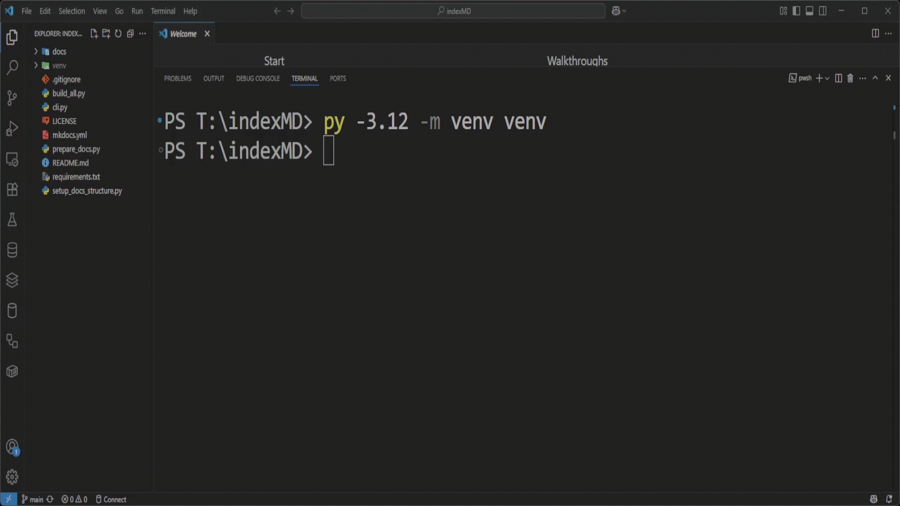
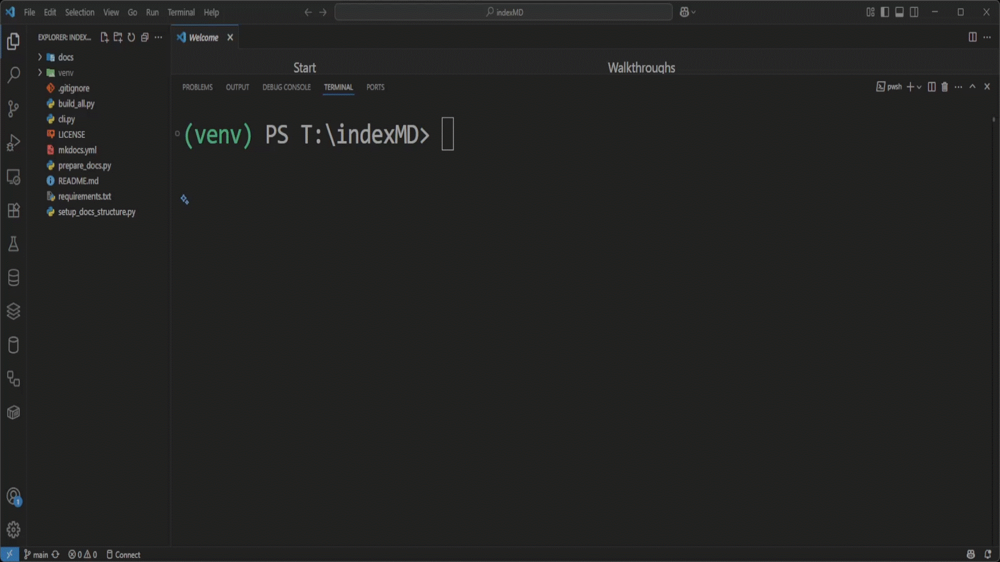
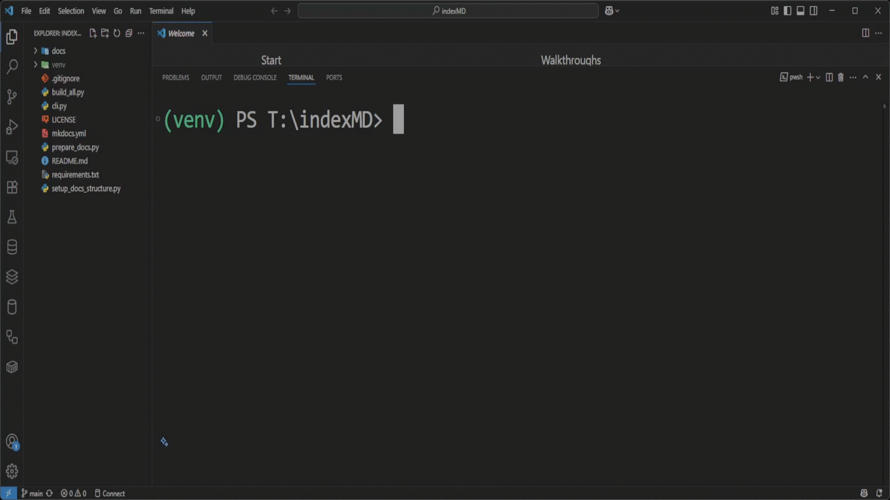

# Index Markdown

<p align="center">
  
</p>

---

---


## Features

- 📄 **Markdown-based documentation**  
- 📦 **MkDocs for static site generation**  
- 📑 **Custom HTML overrides**  
- 🌐 **Customizable themes and styles**  
- 📖 **Multi-section support** (About, Contact, Privacy, Terms…)  
- 🔗 **Important links section**


---

## Clone the Repository

To get started, clone this repository to your local machine using Git:

```bash
git clone https://github.com/TamerOnline/indexMD.git
cd indexMD
```

- Make sure you have Git installed: [https://git-scm.com](https://git-scm.com)

<p align="center">
  <a href="screenshots/clone-the-repository.gif">
    
  </a>
</p>

📽️ Quick Clone of the Encryption Service Tools in action  

---

## Quick Start

### Create Virtual Environment

```bash
# Windows
py -3.12 -m venv venv
.\venv\Scripts\Activate
```

<p align="center">
  <a href="screenshots/Windows.gif">
  
  </a>
</p>
📽️ Quick Windows of the Encryption Service Tools in action

---

```bash
# macOS / Linux
python3 -m venv venv
source venv/bin/activate
```

---

### Optional: Upgrade pip (recommended)

Before installing dependencies, it's recommended to upgrade `pip` to the latest version to avoid compatibility issues.

```bash
python -m pip install --upgrade pip
```

<p align="center">
  <a href="screenshots/Upgrade_pip.gif">
  
  </a>
</p>
📽️ Upgrading pip on Windows (recommended)

---

### Install Dependencies

```bash
pip install -r requirements.txt
```

<p align="center">
  <a href="screenshots/install.gif">
  
  </a>
</p>
📽️ Quick install of the index MD Tools in action

---

## indexMD Control Panel

```bash
py cli.py
```

<p align="center">
  <a href="screenshots/cli-panel.gif">
    
  </a>
</p>

🧠 A simple yet powerful command-line interface to manage your documentation workflow easily:  
Build, Prepare, Serve, Deploy, or just Check version — all in one menu!

### CLI Options Explained

| Option | Description |
|--------|-------------|
| `1. Build Documentation` | Generates the static site using `mkdocs build`. |
| `2. Prepare README` | Converts the `README.md` into `index.md` for homepage. |
| `3. Serve Locally` | Launches a local dev server using `mkdocs serve`. |
| `4. Deploy` | Deploys the site to GitHub Pages using `mkdocs gh-deploy`. |
| `5. Check Version` | Displays current versions of key tools like MkDocs. |
| `6. Exit` | Exits the CLI interface. |

---

## Project Structure

The following is the structure of the main project directory:

```text
./
├── 📁 docs/
│   ├── 📁 sections/
│   │   ├── about.md
│   │   ├── contact.md
│   │   ├── important-links.md
│   │   ├── privacy.md
│   │   └── terms.md
│   ├── 📁 stylesheets/
│   │   └── extra.css
│   └── index.md
├── 📁 overrides/
│   └── 📁 partials/
│       ├── footer.html
│       └── header.html
├── .gitignore
├── LICENSE
├── README.md
├── build_all.py
├── cli.py
├── mkdocs.yml
├── prepare_docs.py
└── requirements.txt

```

---